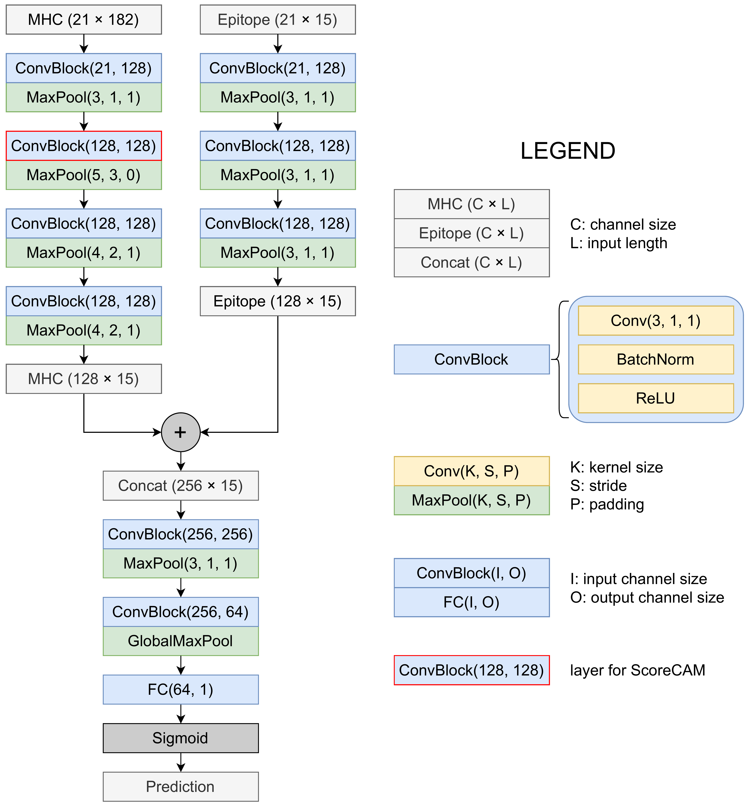

# MHCfovea

MHCfovea is a pan-allele MHC-I-peptide binding predictor which takes MHC-I alleles and peptide sequences to predict the binding probability within 0 and 1. Our predictor is a convolution-based model trained on both binding assay data and ligand elution data from IEDB database. For MHC-I molecules, we use the peptide-binding cleft which is a 182-amino-acid long sequence composed of α-1 and α-2 regions as the encode of MHC-I alleles. As for peptides, any sequence within 8 to 15 amino acids long is available.

Model Architecture:


In addition to binding prediction, MHCfovea provides an interpretation of the relation between MHC-I sequences and epitop-binding motifs. We apply ScoreCAM on our model to select important positions of MHC-I sequences, and expand unobserved alleles by prediction to build clusters of MHC-I-peptide binding. Each cluster contains a hyper-motif, representing the preference of epitope binding, and an allele signature, representing the pattern of MHC-I sequences. For each queried allele, the epitope-binding motif and important MHC-I residues are reported. The epitope-binding motif is built from an independent dataset where peptides with prediction scores over 0.9 are used to generate the motif. The important MHC-I residues are calculated from the allele signature. Only residues simultaneously present in the target allele and positive part of the allele signature are highlighted.

Interpretation of HLA-B:


If you find MHCfovea useful in your research please cite:


## Installation
1. Download/Clone MHCfovea
```
git clone https://github.com/kohanlee1995/MHCfovea.git
cd MHCfovea
```
2. Install reqiured package
```
apt-get install python3
apt-get install python3-pip
pip3 install -r requirements.txt
```

## Usage


## Example
